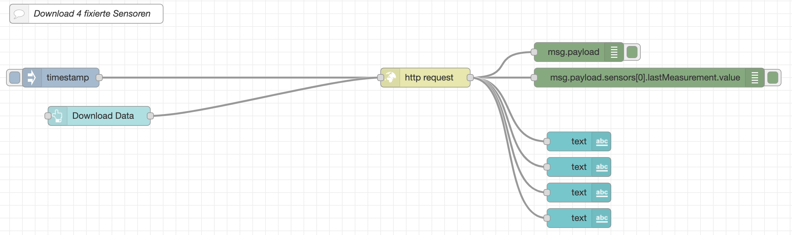
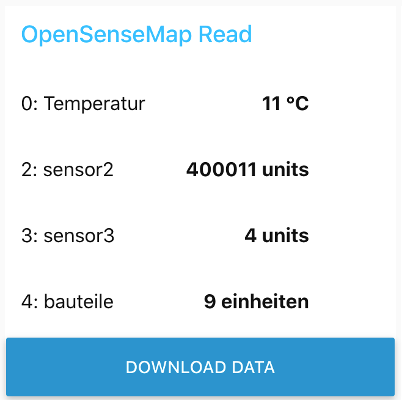
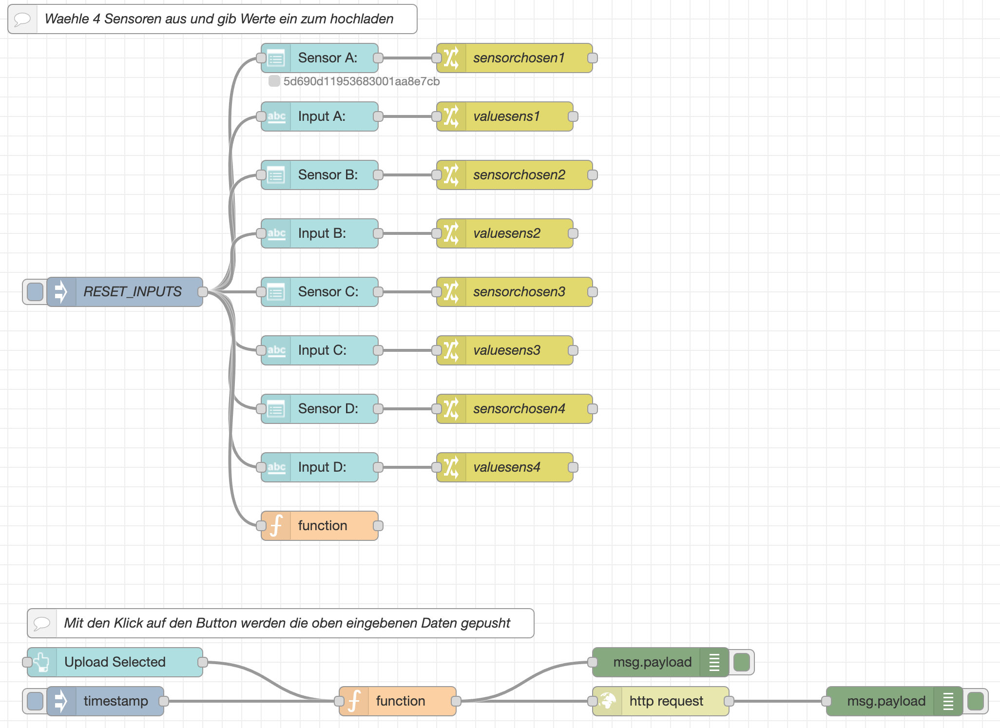
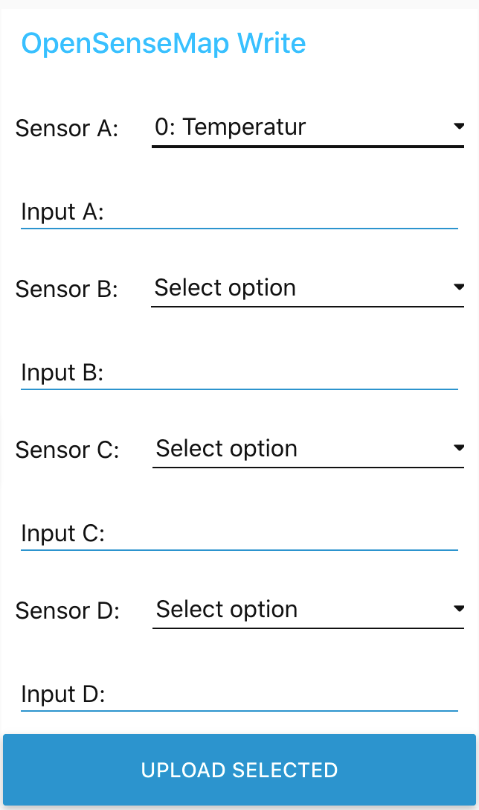

# CPP  

## Physical Computing  

### Einzel-Doku node-RED Projekt Block1  

#### Aufgabenstellung

Für den gesamten LV-Block „Physical Computing Node-RED“ gibt es trotz Gruppenarbeitsstil eine **Einzelbeurteilung**. Bitte das erarbeitete Gruppenprojekt (max. 2er Gruppe) umfangreich und kreativ in Form einer Fotodoku (Blog) aufbereiten.  

- umfangreiche Fotodoku der Testaufbauten, Skizzen, Pläne (z.B. tinkercad), Screenshots der Arbeitsschritte im node-RED  
- Erkenntnisse und Lernergebnisse (jeweils **ca. 3 Sätze pro Thema**)  
- Probleme sollen ebenfalls analysiert und dokumentiert werden  

Das node-RED Projekt exportieren und jeweils einzeln als .json-file in der Doku hinzufügen.  

- Anforderungen und Kriterien zur Beurteilung max. 100 Pkt.  
  - Bereitstellung eines Dashboards auf Basis von node-RED  
  - Abruf und Darstellug der Daten von opensensmap per API-Request oder Labor-Equipment (z.B. Dobot MG400 Roboter)  
  - Bereitstellung eines Daten-Eingabe-Formulars mit 4 Werten  


#### Umsetzung  

Wie am eCampus beschrieben, ist in der OpenSenseMap die `FH-Demo-Sensorbox` zu finden. Diese kann mit folgender Url ausgelesen werden: https://api.opensensemap.org/boxes/5d690d11953683001aa8e7c6/sensors



Wie in der Abbildung des Node-RED-Editors zu sehen, werden die Sensordaten in einen JSON-Array mit ihren Werten bzw ihrer Klassifikationen zurückgegeben. In dem Array `Sensors` befinden sich 11 Objekte (0-10) und diese können einzeln mit Hilfe der eckigen Klammern adressiert werden. In den Textfeldern werden folgende Werte hinterlegt:

+ Sensorname: `{{msg.payload.sensors[0].title}}`  

+ Sensorwert: `{{msg.payload.sensors[0].lastMeasurement.value}}`  

+ Gemessene Einheit: `{{msg.payload.sensors[0].unit}}`  

Am Dashboard können per Knopfdruck die aktuellen Werte geladen und vier fix eingestellte Sensoren angezeigt werden.  




Ebenfalls können Werte in die `FH-Demo-Sensorbox` geschrieben werden. Es wurden vier Dropdown-Menüs für die Auswahl des jeweiligen Sensors angezeit und dazu vier Eingabefelder für die jeweiligen Werte. Die Werte werden in Flow-Variablen zwischengespeichert. Vom Node-Red-Editor aus, können die Variablen geleert/bereinigt werden.  



Mit Klick auf den Button  `Upload selected` werden die Werte mittels der function-node in ein JSON-Objekt zusammengefasst und per http-Request an die URL https://api.opensensemap.org/boxes/5d690d11953683001aa8e7c6/data gesendet.  

Die function-Node kümmert sich um die Aufbereitung des JSON-Objekts.  

```
msg.headers = {
    "content-type" : "application/json"
};

msg.payload = {
    
};

if (flow.get("valuesens1")!==undefined && flow.get("valuesens1")!==null && flow.get("sensorchosen1")!==undefined && flow.get("sensorchosen1")!==null) 
{
	msg.payload[flow.get("sensorchosen1")] = flow.get("valuesens1");
}
if (flow.get("valuesens2")!==undefined && flow.get("valuesens2")!==null && flow.get("sensorchosen2")!==undefined && flow.get("sensorchosen2")!==null) 
{
	msg.payload[flow.get("sensorchosen2")] = flow.get("valuesens2");
}
if (flow.get("valuesens3")!==undefined && flow.get("valuesens3")!==null && flow.get("sensorchosen3")!==undefined && flow.get("sensorchosen3")!==null) 
{
	msg.payload[flow.get("sensorchosen3")] = flow.get("valuesens3");
}
if (flow.get("valuesens4")!==undefined && flow.get("valuesens4")!==null && flow.get("sensorchosen4")!==undefined && flow.get("sensorchosen4")!==null) 
{
	msg.payload[flow.get("sensorchosen4")] = flow.get("valuesens4");
}

return msg;
```

Es werden nur Sensoren an die OpenSenseMap übermittelt, wenn das jeweilige Dropdown und das Eingabefeld befüllt ist. Wenn nicht wird der Sensor übersprungen.  

Das Dashboard sieht wie folgt aus:  




Am Smartphone werden die zwei Gruppen direkt untereinander dargestellt.  