# CPP  

## Physical Computing  

### Einzel-Doku node-RED Projekt Block2  

#### Aufgabenstellung  

**Anforderungen und Kriterien zur Beurteilung max. 100 Pkt.**  

- Bereitstellung eines Dashboards auf Basis von node-RED  
- (optional) Erstellung eines opensensemap Accounts und Eintrag einer Sensorbox mit 3 Messpunkten (Sensoren)  
- (optional) Bereitstellung eines Daten-Eingabe-Formulars (Dashboard) mit 3 Werten (0-255) welche im Intervall von 30 Sekunden auf die angelegten Messpunkte per API-Aufruf geladen werden  
- Einlesen von Messwerten von 3 Sensoren per Mikrcontroller (Arduino, ESP, od. Controllino) in Node-Red z.B. Luftfeuchtigkeit, Temp. und Helligkeit oder Festo Tec2Screen Simulation  
- Upload der Daten auf opensensemap im Intervall von 30 Sekunden (eigene Sensorbox oder FH-Demo-Sensorbox)  
- Abruf und Darstellug von Daten der opensensmap per API-Request oder Labor-Equipment (z.B. Dobot MG400 Roboter)  
- Ein Event soll basierend auf einer Werteänderung der abgerufenen Daten ausgelöst werden.  
  Z.B.: Befindet sich der Roboter in einem Error, soll am Arduino/Controllino eine Signalleuchte ausgelöst werden.  
  Z.B.: Liegt ein Wert der FH-Demo-Sensbox außerhalb des festgelegten Bereichs, soll am Arduino/Controllino eine Signalleuchte ausgelöst werden.  
- (optional) Visualisierung eines Datensatzes eines Sensors in Form eines XY-Diagrams im Dashboard, abruf per API-Aufruf auf OpenSenseMap  

#### Umsetzung  

Der Code der Übung aus dem Unterrichtstag wurde teilweise wiederverwendet.  

Eine SenseBox wurde auf OpenSenseMap angelegt: https://opensensemap.org/explore/62ae2ebfb91502001b9b3e83  

##### Aufbau

Am Arduino wird mittels NodeRED wird ein Fotowiderstand, ein Potentiometer und ein Button eingelesen. Zwei rote und ein grünes Led wird für die Ausgabe verwendet.  

Der Aufbau ist wie folgt:  

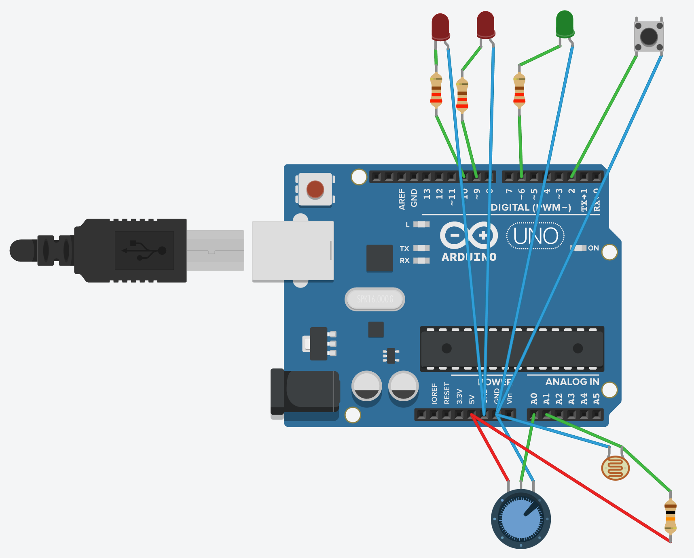

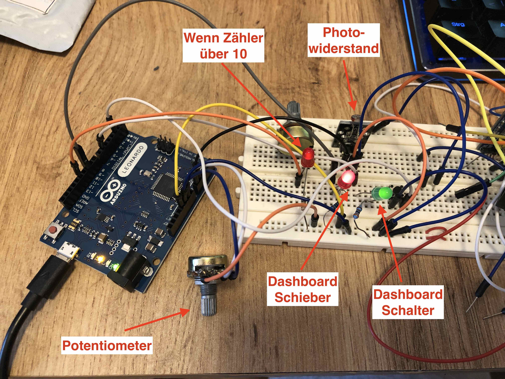

##### Potentiometer am Pin A0  

Das Poti am anlogen Eingang A0 wird eingelesen und auf einen Wert von 0-255 gemappt. Dies dimmt die Led am Pin 9. Ebenfalls wird dieser gemappte Werte zwei mal pro Minute an OpenSenseMap übertragen. Auf 0-100 gemappt wird es mittels Donut-Gauge im Dashboard angezeigt. Mit einen Offset von `+3` wird es in einen Halb-Rund-Gauge im Dashboard angezeigt.  

[Link zum Sensorwerte-JSON](https://api.opensensemap.org/boxes/62ae2ebfb91502001b9b3e83/data/62ae2ebfb91502001b9b3e84)  

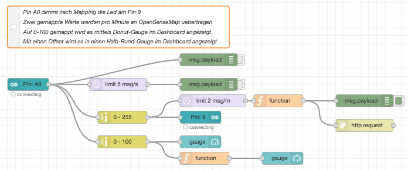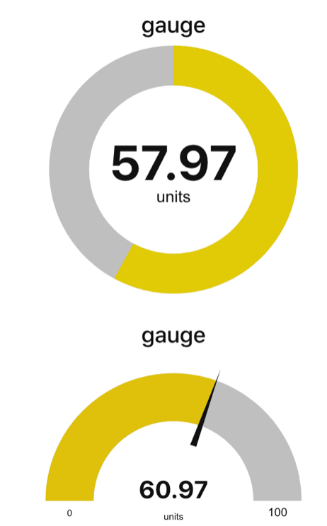

##### Schieberegler und Schalter zum Steuern von Led  

Schieberegler am Dashboard dimmt Led am Pin 10 per PWM.  

Schalter am Dashboard steuert Led am Pin 6.  

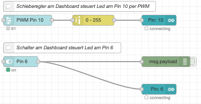

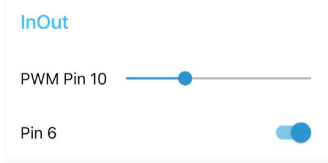

##### Zähler mittels physischen Tasters  

Ein physischer Taster am Pin 2 löst einen Download eines Werts auf OpenSenseMap aus. Die Zahl wird um 1 erhöht und wieder hochgeladen. Ist die Zahl größer 10 wird die Led am Pin 12 eingeschalten. Wird die Zahl 20 erreicht, beginnt der Zähler wieder bei 1. Das Drücken des Tasters wird in einem Diagramm am Dashboard dargestellt.  

[Link zum Sensorwerte-JSON](https://api.opensensemap.org/boxes/62ae2ebfb91502001b9b3e83/data/62ae3c77b91502001ba20721)  

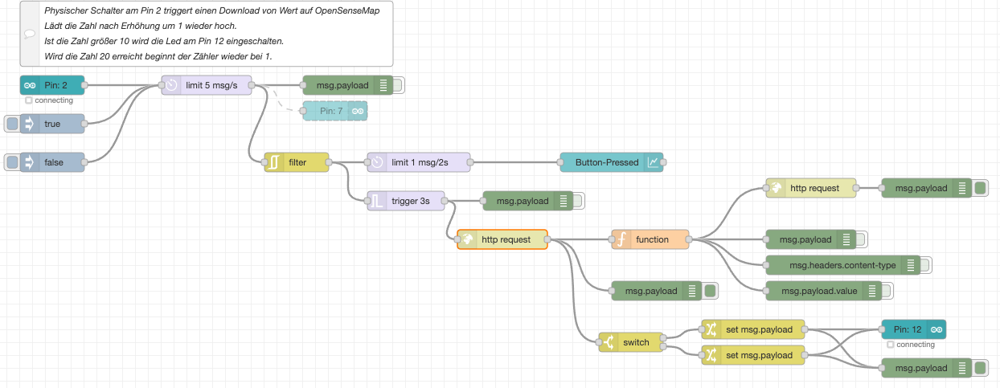 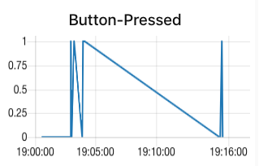

##### Photoresistor an Pin A1  

Der durch Licht verändernde Widerstand am Pin A1 wird in Flow-Variable gespeichert.  Alle 30 Sekunden wird der Wert in die OpenSenseMap gepusht. Am Dashboard ist der Wert nicht zu finden.  

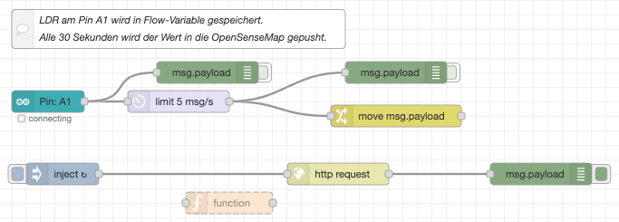

[Link zum Sensorwerte-JSON](https://api.opensensemap.org/boxes/62ae2ebfb91502001b9b3e83/data/62ae50c5b91502001babf0ae)  

##### Werte von A0 (Download OpenSenseMap) in Diagramm  

Die letzten zehn A0-Werte, die laufend in die [OpenSenseMap](https://api.opensensemap.org/boxes/62ae2ebfb91502001b9b3e83/data/62ae2ebfb91502001b9b3e84) geladen werden, werden wieder heruntergeladen. Die Zeitstempel müssen korrekt formatiert und das JSON richtig aufgebaut werden, damit die Werte in ein XY-Diagramm am Dashboard gepusht werden können.  

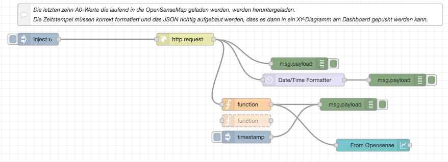

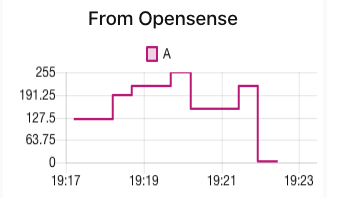

##### API  

Am Ende wurde eine API erstellt, welche die aktuellen Werte mittels JSON zur Verfügung stellt. Die (bei mir passende) URL lautet: http://localhost:1880/api/block2  

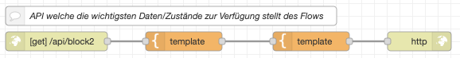

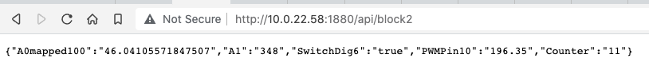

##### Probleme  

Die in der Mitschrift von Tag 2 erwähnten [Verbindungsprobleme](./CPP_PhyCom_Tag2.md) stellten auch hier teilweise eine große Herausforderung dar.  

Die Formatierung des JSON für das XY-Diagramm stellte die größte Herausforderung dar und war leider auch in NodeRED nicht klar dokumentiert. Nur durch die Versuche ein 1:1 Abbild einer [Anleitung](https://github.com/node-red/node-red-dashboard/blob/master/Charts.md#example) zu erstellen, kam es zu einem Erfolg.  

##### Gesamtübersicht Dashboard

Das gesamte Dashboard sieht wie folgt aus:  

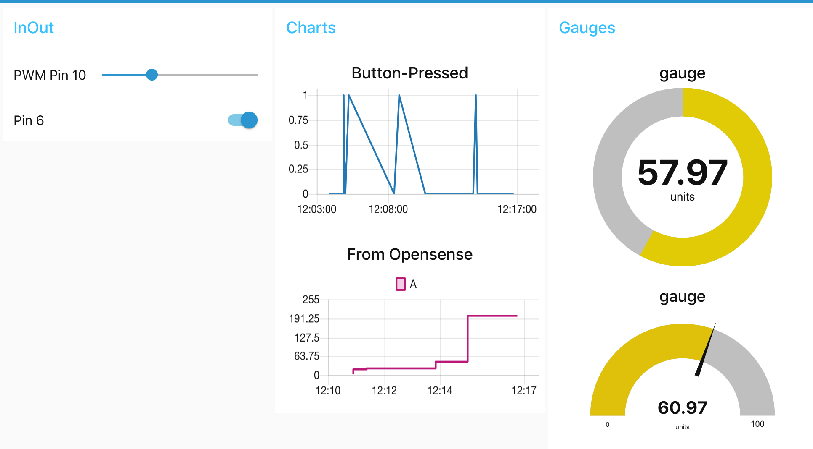