# CPP  
## Physical Computing Tag 1  

### Übung 1.1  

#### Aufgabenstellung  

Installation Node-RED  
+ Cross-Plattform (PC, Raspberry, Cloud/Server)  
+ siehe Tutorial ecampus  
+ Zugriff auf Programmierinterface per Browser  
+ Z.B. 192.168.0.100:1880 im Browser oder localhost:1880  
+ Installation der Paletten (siehe Tutorial ecampus)  

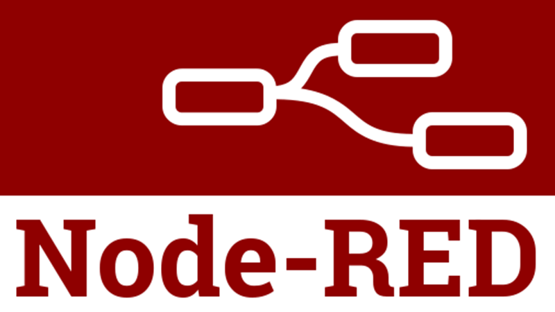

#### Umsetzung   

Die Installation wurde per Docker-Compose vorgenommen.  

Mit der Datei `docker-compose.yml` wird ein Node-RED-Container wie folgt definiert:

```
version: "3.7"

services:
  node-red:
    image: nodered/node-red:latest
    environment:
      - TZ=Europe/Amsterdam
    ports:
      - "1880:1880"
    volumes:
      - ./node-red-data:/data
```

Wird per Terminal/CMD/Powershell in den Ordner des YAML-Files navigiert, ist der Befehl `docker-compose up -d` auszuführen.  Eventuell muss die Shell als Administrator / mit `sudo` ausgeführt werden.  

Durch die Zeile `./node-red-data:/data` werden die Daten neben den YAML-File in einen Unterordner abgelegt und gehen bei einem Neustart des Containers nicht verloren.

Nach Download des Images und kurzer Ladezeit ist Node-RED per http://localhost:1880/ aufrufbar.  

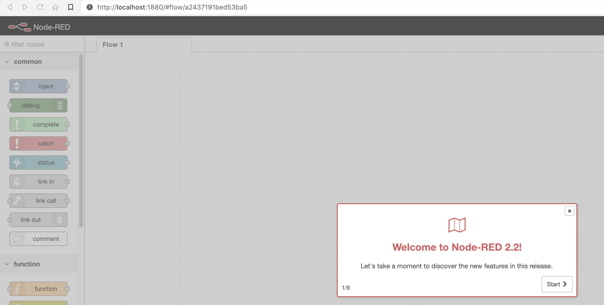 

<div style="page-break-after: always"></div>

### Übung 1.2  

#### Aufgabenstellung  

+ Kennenlernen des Interface  
+ Node-Browser durchsehen  
+ Erste Nodes in den Arbeitsbereich (flow) ziehen und verknüpfen  
+ Timestamp generieren (inject node) und per debug node ausgeben  
+ Timestamp verarbeiten (z.B. nur Sekunden) und per debug ausgeben  
+ Node-Infofenster kennenlernen  
+ Eigene IP Adresse per debug node anzeigen  
+ Import und Export von flows, und nodes  

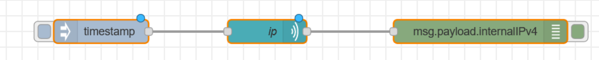

**Palette:** node-red-contrib-ip    


#### Umsetzung   

##### Erste Nodes  

Nach dem Kennenlernen von Node-Red werden die Schritte `Timestamp generieren` und `Timestamp verarbeiten` durchgeführt.  

Nun werden in den Flow folgende Nodes eingefügt:  

+ Inject  
+ Debug  
+ Date/Time Formatter  

Und wie folgt verbunden:  

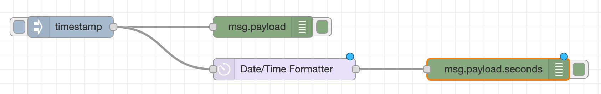 

Standardmäßig ist der Payload der inject-node auf  `timestamp` gestellt.  

Bei der Konfiguration des `Date/Time Formatters` ist darauf zu achten, dass das Input-Format und das Output-Format auf `Europe/Vienna` gestellt ist.  

Durch die Eingabe von `msg.payload.seconds`im debug-node wird direkt auf die Sekunden im JSON-Objekt zugegriffen.  

Durch einen Klick auf das Quadrat in der inject-node wird die Information in der debug-Console ausgegeben, wenn die debug-node aktiviert ist.  

Alternativ zur Flow-Ansicht, können die Objekte auch im Info-Menü durchsucht und konfiguriert werden.  


##### Installation Palette  

Über das Node-RED-Menü (Ecke rechts oben) kann der Menüpunkt `Manage Palette`aufgerufen werden. Im Reiter `Install` ist nach `node-red-contrib-ip` zu suchen und per Install-Button zu installieren.  

Ist die Installation erfolgt, wechselt der Status auf `installed`.  

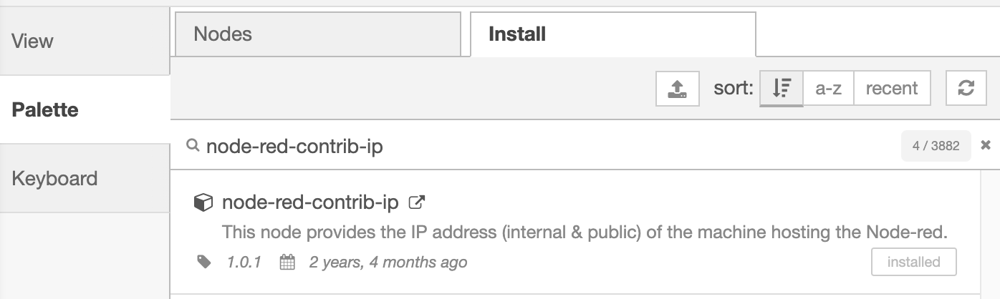  


##### Abfrage IP    

Nun werden in den Flow folgende Nodes eingefügt:  

+ timestamp  
+ ip  
+ debug  

Und wie folgt verbunden:  

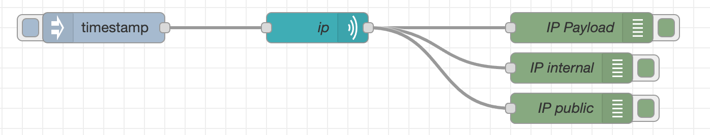

Die debug-nodes wurden wie folgt konfiguriert:  

+ msg.payload => Gesamter Payload  
+ msg.payload.internalIPv4 => Nur interne IP-Adresse  
+ msg.payload.publicIPv4 => Nur externe IP-Adresse  

Der Timestamp der inject-node wird komplett überschrieben und durch den Payload des ip-nodes ersetzt:

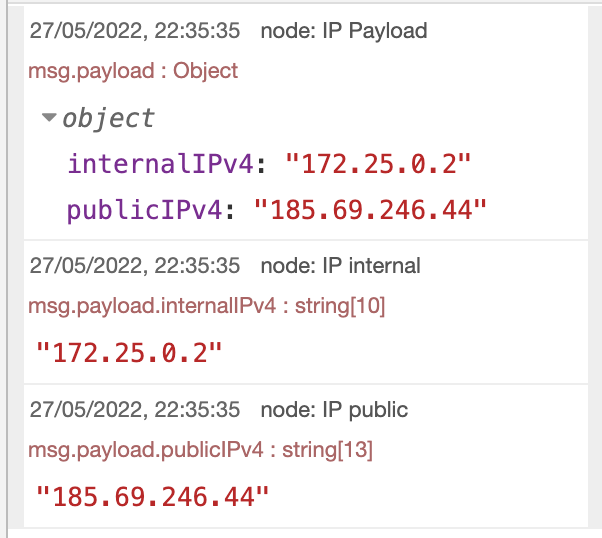


##### Export, Import von flows und nodes    

Über das Node-RED-Menü können flows und nodes importiert bzw exportiert werden.  

Nach dem Import ist darauf zu achten, dass am Zielhost alle Abhängigkeiten installiert sind.  

<div style="page-break-after: always"></div>

### Übung 2.1  

#### Aufgabenstellung  

+ Dashboard-Funktionen  
+ Node-Browser durchsehen  
+ Dashboard-Setupfenster kennenlernen  
+ Tabs und Gruppen Funktion kennenlernen  
+ Erste Dashboard-Nodes (Button, Slider, Text und Gauge) verknüpfen  
+ Dashboard anzeigen unter localhost:1880/ui  
+ Timestamp verarbeiten (z.B. nur Sekunden) und per gauge visualisieren  

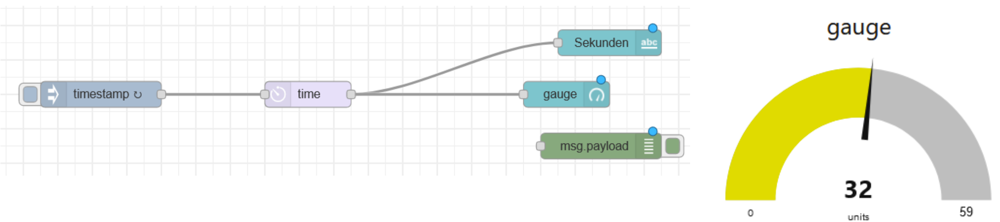

**Palette:**  

+ node-red-contrib-moment  
+ node-red-dashboard  


#### Umsetzung   

Die in der Aufgabenstellung angegebenen Paletten werden wie in Übung 1.2 ebenfalls installiert.  

Mithilfe der Kategorie `Dashboard` werden nun folgende Flows gebaut:  

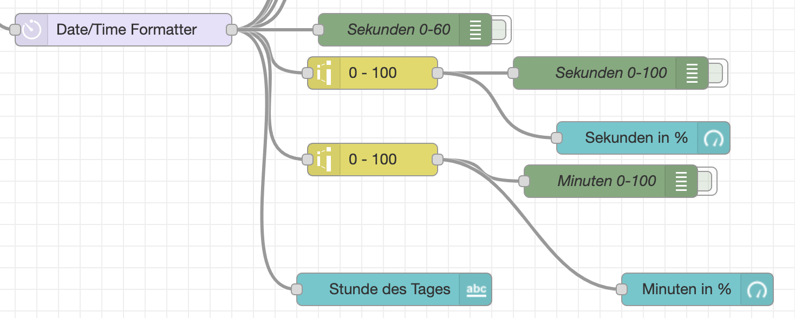

Mit den gelben Bausteinen wird die Abbildung der Minuten bzw Sekunden von 0-60 auf 0-100 geändert, damit es in `%` dargestellt werden kann. Die blauen Nodes stellen die Dashboardelemente dar und dort ist als Value das passende JSON-Objekt einzutragen. Beispiel für Minuten: `{{payload.date.minutes}}`  

Auch der IP-Flow wird um ein Dashboardelement erweitert:  

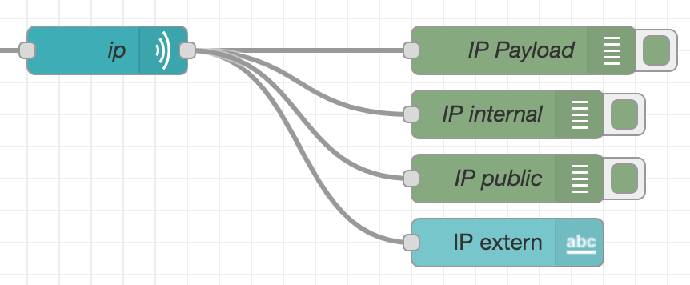

Im Anschluss müssen die Tabs & Groups zugeorndet werden:  

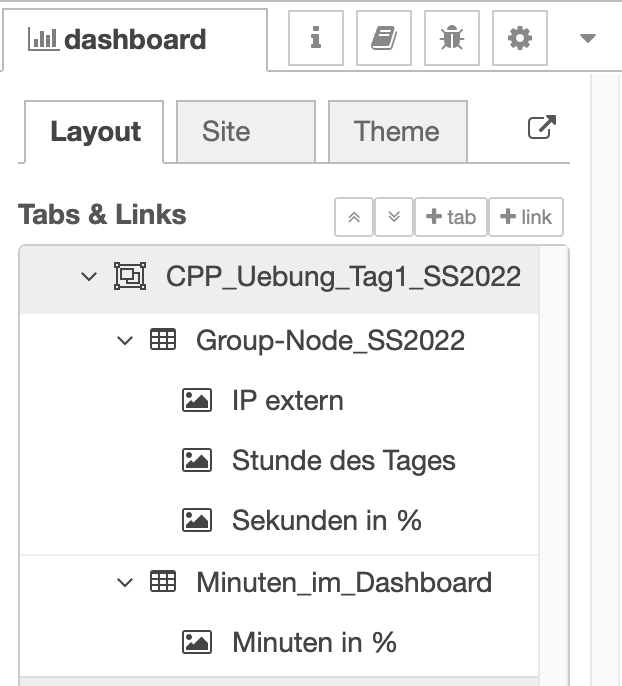

Das Dashboard wird nun wie folgt dargestellt:  

http://localhost:1880/ui/  

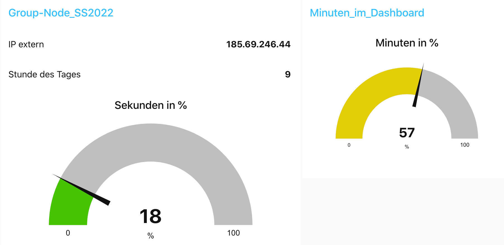


<div style="page-break-after: always"></div>

### Übung 2.2

Dashboard-Funktionen  

- Smartphone-Dashboard entwerfen  
- Zeit (Stunde, Minute, Sekunde)  
- Sekunden per Gauge (donut-style) gemapped als 100% anzeigen  
- Stunde und Minute per Textausgabe, Labels hinzufügen  
- Button hinzufügen und IP-Adresse bei Klick-Event als Textausgabe anzeigen  
- Color-Picker zur Änderung der Background-Color einfügen  
- Dashboard per QR-Code aufrufbar machen

  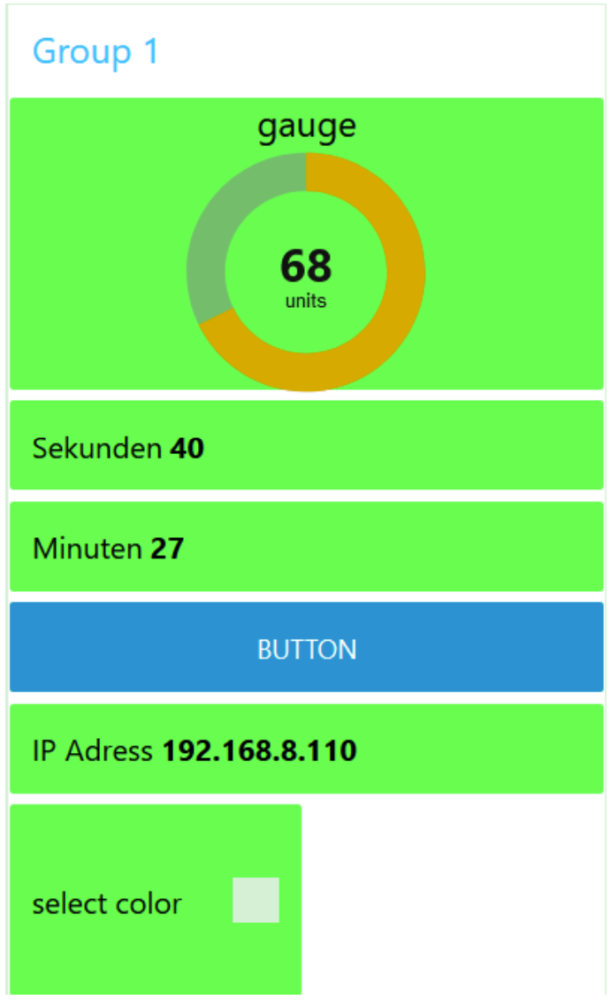


#### Umsetzung   

Es wurde eine neue Gruppe im Dashboard angelegt und der Flow mit folgenden Objekten erweitert.  

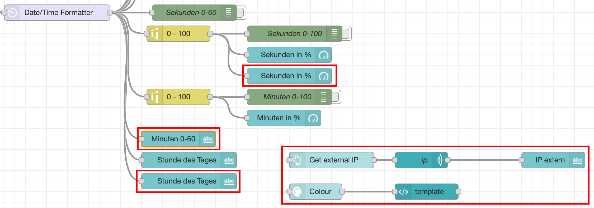

Im Template-Baustein ist folgender Code zu hinterlegen:  

```
<style>
body.nr-dashboard-theme {
    background-color: #{{msg.payload}};
    font-family: -apple-system, BlinkMacSystemFont, Segoe UI, Roboto, Oxygen-Sans, Ubuntu, Cantarell, Helvetica Neue, sans-serif;
}

</style>
```

Das Dashboard sieht wie folgt aus:  

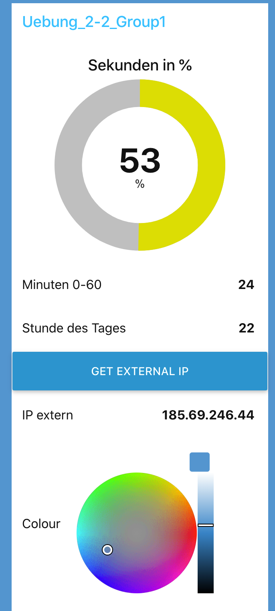


In einen weiteren Schritt soll das Dashboard per QR-Code aufrufbar gemacht werden. Dies wird in einen eigenen Tab umgesetzt:  

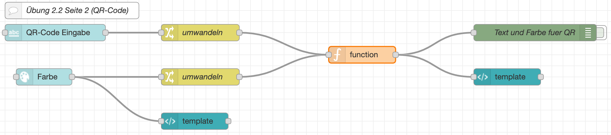

Es wird eine Eingabzeile und ein Color-Picker angeboten, dadurch kann der Inhalt und die Farbe des QR-Codes gewählt werden. Mithilfe der `Umwandeln-Bausteine` werden die Eingaben so aufbereitet, dass diese unterschieden werden können. Da die Information nur bei Änderungen oder bei einem Input übertragen werden, werden die Werte mithilfe des function-Bausteins in zwei Flow-Variablen gespeichert. Es wurde die API von https://goqr.me/ verwendet. Wenn keine Eingabe gemacht wurde, dann zielt der QR-Code auf das Dashboard und hat die Farbe schwarz.   

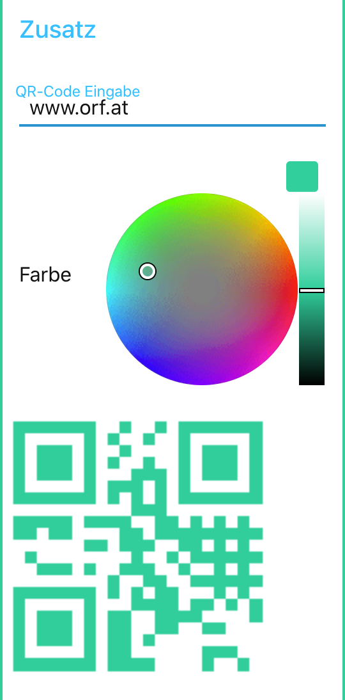
