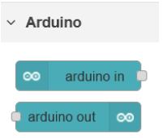

# CPP  

## Physical Computing  

### Übung 3.1 bis 3.4  

Im Unterricht am 02.06.2022 wurden die bisherigen Umsetzungen aus dem ersten Block besprochen und die Unklarheiten wurden gelöst.  

Übung 3.1 bis 3.4 wurden umgesetzt. Die Übung 3.3 setzt besonders auf die Abfrage von Sensorwerten des MG400 Roboters im Lab. Die Übungen sind nahezu ident zu der Aufgabenstellung aus Block 1 und daher einfach zum Nachlesen in [CPP_PhyCom_Einzeldoku_Block1](./CPP_PhyCom_Einzeldoku_Block1.md).  

### Übung 4.1  

#### Aufgabenstellung  

Hardware-Anbindung (Basis-Arduino-Firmata)  

▪ Palette „node-red-node-arduino : arduino in“ installieren  
 ▪ Arduino IDE installieren inkl. Driver für Arduino Uno, etc. (gibt‘s auch für Linux)  
 ▪ Arduino Example Upload Firmata „Standard Firmata“  
 ▪ Einlesen und Ausgabe von analogen und digitalen I/O Pins  
 ▪ Verarbeitung (mapping) und Anzeige der eingelesenen Daten in Node-RED  
 ▪ Ausgabe von Events am Arduino (z.B. Status per LED-Signal oder Servo-Motor)  

  

Arduino Nodes müssen auch noch konfiguriert werden und auf den seriellen Port vom USB zugewiesen werden.  

#### Umsetzung  

Schritt 1-3 wurden wie in der Anleitung umgesetzt.  

Im Unterricht wurden die Controllinos der Schule verwendet, hier schematisch mit den Arduinos dargestellt.  

In NodeRED wurde es wie folgt umgesetzt:  

+ Die Led an Pin 6 wird durch einen Schalter am Dashboard ein und ausgeschaltet.  
+ Die Led an Pin 9 wird durch ein Poti am Anschluss A0 mittels Mapping gedimmt.  
+ Die Led an Pin 10 wird durch einen Schiberegler am Dashboard gedimmt.  
+ Der Schlater an Pin 2 hat Anfangs die interne Led an Pin 13 ein und ausgeschaltet, wurde dann durch eine On- und Off-Inject-Node ersetzt.  
+ Das Poti am Anschluss A0 wird zusätzlich mit einen Gauge am Dashboard visualisiert.  

Die Stuerungs des Arduinos wurden auch in Verbindung mit der OpenSenseMap und dem MG400 Roboters des Labs verwendet.  

#### Probleme

Da ich NodeRED in einem Docker-Container laufen hatte, habe ich es unter Windows, als auch unter Mac nicht geschafft das Microcontrollerboard durchzureichen und eine Verbindung in Docker per NodeRED damit herzustellen. Bei umfangreicher Recherche scheint es, dass in Windows durch WSL2 und in Mac gewisse Schranken gibt, welche das weitergeben von USB-Geräten nicht möglich macht. [Bug-Ticket](https://github.com/docker/for-mac/issues/900)  

In einer Linux-VM im Gegensatz, war das verbindung trotz Docker kein Problem, wenn das Gerät beim Aufruf wie folgt weitergegeben wurde:  

`docker run --rm -it -p 1880:1880 --device=/dev/ttyACM0:/dev/ttyACM0 --name mynodered nodered/node-red`

Egal ob NodeRED nativ oder im Container läuft, gab es immer Probleme beim Neuverbinden mit den Mircocontroller nach einer Aktualisierung des Flows. Es wurden verschiedene Arduinos getestet. Die Bibliothek finde ich leider auch schlecht implementiert, da es nur eine Möglichkeit den Port zu definieren, aber die Baud-Rate nicht konfiguriert werden kann. Die korrekte Baud-Rate ist auch nicht in der Dokumentation angeführt. Der Standard ist zwar `57600`, aber da man die Library auch ohne Firmata für die serielle Kommunikation nutzen kann, wäre es hilfreich diese zu verstellen. Vielleicht werden auch verschiedene Baud-Rate versucht, jedoch fehlt auch hierzu jedlicher Hinweis.  
